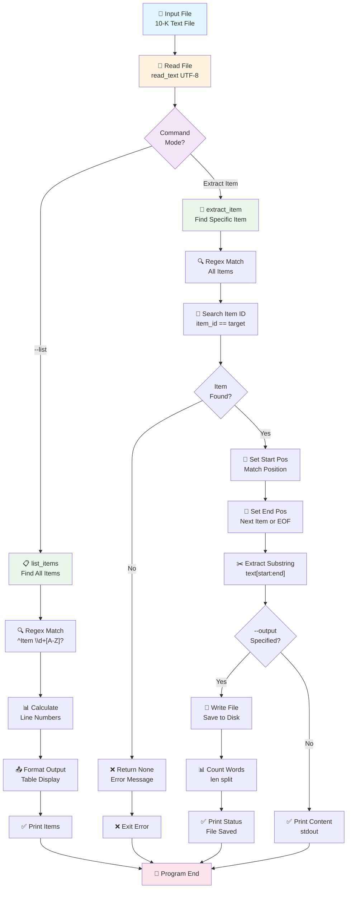

# Extract Item - Logic & Data Flow Documentation

## 📋 Mục đích
Script `extract_item.py` giúp chiết xuất nội dung của các mục (Item) cụ thể từ file báo cáo 10-K của SEC.

---

## 🔧 Logic xử lý dữ liệu

### 1. **Khái quát các hàm chính**

| Hàm | Đầu vào | Đầu ra | Mục đích |
|-----|---------|---------|---------|
| `build_item_pattern()` | `item_id: str` | `re.Pattern` | Tạo regex pattern để tìm kiếm Item header |
| `list_items()` | `text: str` | `list[tuple]` | Liệt kê tất cả Items trong file |
| `extract_item()` | `text: str, item_id: str` | `str \| None` | Trích xuất nội dung của một Item |
| `main()` | CLI args | None | Xử lý lệnh dòng lệnh và điều phối logic |

---

### 2. **Chi tiết từng hàm**

#### **build_item_pattern(item_id)**
```python
def build_item_pattern(item_id: str) -> re.Pattern:
```
- **Input**: ID của Item (e.g., "1A", "7", "9A")
- **Xử lý**:
  1. Normalize: chuyển đổi sang uppercase (`1a` → `1A`)
  2. Loại bỏ khoảng trắng
  3. Tạo regex pattern để match dòng bắt đầu với "Item <ID>"
     - Ví dụ: `Item\s+1A\s*[.\-:]?\s*\S`
     - Pattern này match: `Item 1A.`, `Item 1A `, `Item 1A:` (case-insensitive)
- **Output**: Compiled regex pattern

---

#### **list_items(text)**
```python
def list_items(text: str) -> list[tuple[str, int, str]]:
```
- **Input**: Toàn bộ nội dung file 10-K
- **Xử lý**:
  1. Sử dụng regex pattern: `^(Item\s+(\d+[A-Z]?)\s*[.\-:]?\s*.+)$`
     - Match: dòng bắt đầu với "Item" + số + (tùy chọn chữ) + tiêu đề
  2. Với mỗi match:
     - Nhóm 1: Toàn bộ header line
     - Nhóm 2: Item ID (e.g., "1A", "7")
  3. Tính số dòng: đếm `\n` trước vị trí match
  4. Collect kết quả: `(item_id, line_number, header_text)`
- **Output**: List các tuple `[(ID, dòng, header), ...]`

---

#### **extract_item(text, item_id)**
```python
def extract_item(text: str, item_id: str) -> str | None:
```
- **Input**: 
  - `text`: Toàn bộ file
  - `item_id`: ID muốn chiết xuất (e.g., "1A")
  
- **Xử lý**:
  1. Normalize item_id → uppercase
  2. Tìm tất cả Item headers trong file bằng regex
  3. **Xác định vị trí bắt đầu**:
     - Loop qua tất cả matches
     - Tìm match đầu tiên có ID == item_id cần tìm
     - Ghi lại vị trí bắt đầu (`start_match`)
  4. **Xác định vị trí kết thúc**:
     - Mặc định: cuối file (`len(text)`)
     - Nếu tồn tại Item kế tiếp: dùng vị trí bắt đầu của Item đó
  5. **Cắt nội dung**: `text[start:end].strip()`
  6. Return: nội dung Item (hoặc `None` nếu không tìm thấy)

- **Output**: String chứa nội dung Item hoặc `None`

---

#### **main()**
```python
def main():
```
- **Input**: Command-line arguments
- **Xử lý**:
  1. **Phân tích arguments**:
     - `file`: Đường dẫn file 10-K
     - `item` (optional): ID của Item cần chiết xuất
     - `--list` (optional): Liệt kê tất cả Items
     - `--output` (optional): File output
  
  2. **Xác thực file**:
     - Kiểm tra file tồn tại
     - Đọc file (UTF-8, bỏ qua lỗi encode)
  
  3. **Xử lý theo mode**:
     - **Mode `--list`**: Gọi `list_items()` → in bảng Items
     - **Mode chiết xuất**: Gọi `extract_item()` → in hoặc lưu file
  
  4. **Xử lý lỗi**:
     - File không tồn tại → Exit 1
     - Item không tìm thấy → Exit 1
  
  5. **Output**:
     - In màn hình hoặc lưu file
     - Hiển thị số từ và đường dẫn file

---

## 📊 Data Flow Diagram



---

## 🔄 Chi tiết Data Flow theo từng bước

### **Scenario 1: Liệt kê Items (`--list`)**

```
Input: extract_item.py file.txt --list
       ↓
1. Read file → text (string)
2. list_items(text)
   - Regex match: ^(Item\s+(\d+[A-Z]?)\s*[.\-:]?\s*.+)$
   - For each match: extract item_id, line_no, header
   - Build list: [(1, 166, "Item 1. Business"), (1A, 253, "Item 1A. Risk Factors"), ...]
3. Format & print table
   ↓
Output: 
Item       Line  Header
----------------------------------------------------------------------
Item 1     166   Item 1. Business
Item 1A    253   Item 1A. Risk Factors
...
```

### **Scenario 2: Chiết xuất Item cụ thể**

```
Input: extract_item.py file.txt "1A"
       ↓
1. Read file → text (string)
2. Normalize: "1a" → "1A"
3. extract_item(text, "1A")
   - Find all Items: matches = [<1 at 166>, <1A at 253>, <2 at 475>, ...]
   - Search: found <1A at 253> ✓
   - start_pos = 253
   - end_pos = 475 (position of Item 2)
   - content = text[253:475].strip()
4. Return: content (str with ~7,446 words)
       ↓
Output to stdout:
Item 1A. Risk Factors
Set forth below are material risks...
```

### **Scenario 3: Chiết xuất & Lưu file**

```
Input: extract_item.py file.txt "7" --output item_7.txt
       ↓
1. Read file → text (string)
2. extract_item(text, "7") → content
3. Write to file:
   - out_path = Path("item_7.txt")
   - out_path.write_text(content)
4. Count words: len(content.split())
5. Print status: "Item 7 extracted: 7,148 words → item_7.txt"
       ↓
Output: 
- File: item_7.txt (7,148 words)
- Console: Status message
```

---

## 🛠️ Regex Patterns Explained

### Pattern 1: Item Header Detection
```regex
^Item\s+(\d+[A-Z]?)\s*[.\-:]?\s*.+$
```
- `^Item` - Bắt đầu dòng với "Item"
- `\s+` - 1 hoặc nhiều whitespace
- `(\d+[A-Z]?)` - Capture: số + tùy chọn chữ (1, 1A, 7, 9B, etc.)
- `\s*[.\-:]?` - Tùy chọn dấu . - :
- `\s*.+$` - Phần còn lại (header text)

**Matches**:
- `Item 1. Business`
- `Item 1A. Risk Factors`
- `Item 9A - Controls and Procedures`

### Pattern 2: Specific Item Search (from build_item_pattern)
```regex
^Item\s+1A\s*[.\-:]?\s*\S
```
- Similar nhưng cụ thể hơn (match "1A" thay vì bất kỳ ID nào)

---

## 📌 Key Design Decisions

| Quyết định | Lý do |
|-----------|-------|
| **Regex multiline mode** | Xử lý file lớn, tìm Items ở bất kỳ đâu |
| **Normalize uppercase** | "1a" và "1A" đều được coi là cùng Item |
| **Next Item as boundary** | Tránh double-parsing, tạo ranh giới rõ ràng |
| **UTF-8 + error handling** | File SEC có thể chứa ký tự lạ |
| **Line count via \\n count** | Hiệu quả, không cần parse từng dòng |
| **Optional `--list` mode** | Giúp user khám phá file trước khi chiết xuất |

---

## 🚀 Cách sử dụng

```bash
# Liệt kê Items
python scripts/extract_item.py <file.txt> --list

# Chiết xuất Item 1A
python scripts/extract_item.py <file.txt> "1A"

# Chiết xuất & lưu Item 7
python scripts/extract_item.py <file.txt> "7" --output item_7.txt

# Chiết xuất Item 9A & lưu
python scripts/extract_item.py <file.txt> "9A" -o item_9a.txt
```

---

## 📈 Performance Notes

- **Time Complexity**: O(n) - đọc file 1 lần, regex scan 1 lần
- **Space Complexity**: O(n) - lưu toàn bộ file + extracted content
- **Thích hợp cho**: Files 1-100 MB
- **Bottleneck**: I/O (đọc/ghi file)
