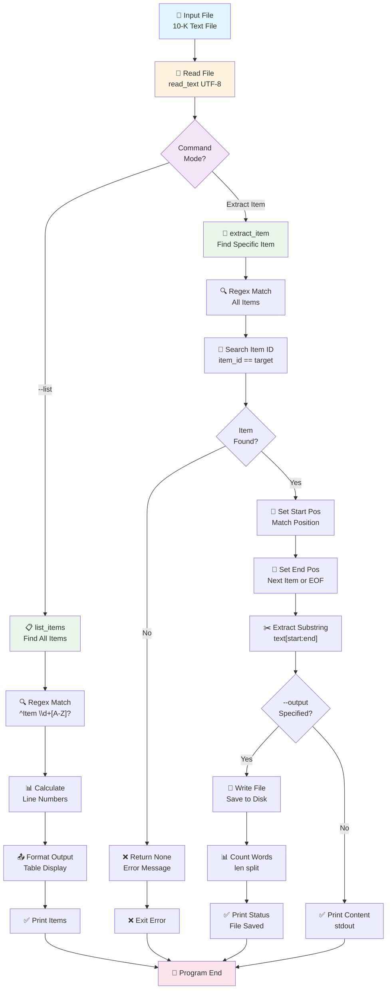

# Extract Item - Logic & Data Flow Documentation

## 📋 Mục đích
Script `extract_item.py` giúp chiết xuất nội dung của các mục (Item) cụ thể từ file báo cáo 10-K của SEC.

---

## 🔧 Logic xử lý dữ liệu

### 1. **Khái quát các hàm chính**

| Hàm | Đầu vào | Đầu ra | Mục đích |
|-----|---------|---------|---------|
| `build_item_pattern()` | `item_id: str` | `re.Pattern` | Tạo regex pattern để tìm kiếm Item header |
| `detect_toc_section()` | `text: str` | `tuple[int\|None, int\|None]` | Xác định vị trí Table of Contents |
| `normalize_line_wrapped_items()` | `text: str` | `str` | Chuẩn hóa Items trên nhiều dòng |
| `is_toc_entry_not_header()` | `text, start, id` | `bool` | Kiểm tra Item có phải ToC entry |
| `is_reference_not_header()` | `text, start, match` | `bool` | Kiểm tra Item có phải tham chiếu |
| `find_item_position()` | `text, item_id, skip_toc` | `int\|None` | Tìm Item với multi-level validation |
| `list_items()` | `text: str` | `list[tuple]` | Liệt kê tất cả Items trong file |
| `extract_metadata()` | `text: str` | `Dict[str, Any]` | Chiết xuất metadata từ SEC header |
| `extract_item()` | `text: str, item_id: str` | `str \| None` | Trích xuất nội dung của một Item |
| `process_files_to_parquet()` | `file_or_dir: Path` | None | Xử lý batch files, xuất Parquet theo năm |
| `main()` | CLI args | None | Xử lý lệnh dòng lệnh và điều phối logic |

---

### 2. **Chi tiết từng hàm**

#### **build_item_pattern(item_id)**
```python
def build_item_pattern(item_id: str) -> re.Pattern:
```
- **Input**: ID của Item (e.g., "1A", "1B", "9A")
- **Xử lý**:
  1. Normalize: chuyển đổi sang uppercase (`1a` → `1A`)
  2. Loại bỏ khoảng trắng
  3. Tạo regex pattern để match dòng bắt đầu với "Item <ID>"
     - Ví dụ: `Item\s+1A\s*[.\-:]?\s*\S`
     - Pattern này match: `Item 1A.`, `Item 1A `, `Item 1A:` (case-insensitive)
- **Output**: Compiled regex pattern

---

#### **detect_toc_section(text)**
```python
def detect_toc_section(text: str) -> tuple[int | None, int | None]:
```
- **Input**: Toàn bộ nội dung file 10-K
- **Xử lý**:
  1. Tìm marker bắt đầu ToC: "Table of Contents" hoặc "PART I" (case-insensitive)
  2. Nếu không tìm thấy → Return `(None, None)`
  3. Tìm điểm kết thúc ToC: 
     - Tìm "Item 1." với nội dung thực chứ không phải trang số
     - Fallback: Tìm "Item 1A"
  4. Tính toán position cho cả start và end
- **Output**: Tuple `(toc_start, toc_end)` hoặc `(None, None)`
- **Ví dụ**:
  ```python
  toc_start, toc_end = detect_toc_section(text)
  # toc_start = 1500, toc_end = 5000
  # → ToC section từ ký tự 1500 đến 5000
  ```

---

#### **normalize_line_wrapped_items(text)**
```python
def normalize_line_wrapped_items(text: str) -> str:
```
- **Input**: Toàn bộ nội dung file 10-K
- **Xử lý**:
  1. **Pattern 1**: Xử lý "Item\n<ID>\n<Title>" → "Item <ID>. <Title>"
     - Regex: `Item\s*\n+\s*(\d+[A-Z]?)\s*\n+` → `Item \1. `
  2. **Pattern 2**: Xử lý "<ID>.\n<Title>" → "<ID>. <Title>"
     - Regex: `(\d+[A-Z]?)\.\s*\n+\s+([A-Z])` → `\1. \2`
- **Output**: Text với Items chuẩn hóa
- **Ví dụ**:
  ```
  Input:  Item
          1A.
          Risk Factors
  
  Output: Item 1A. Risk Factors
  ```

---

#### **is_toc_entry_not_header(text, match_start, item_id)**
```python
def is_toc_entry_not_header(text: str, match_start: int, item_id: str) -> bool:
```
- **Input**:
  - `text`: Toàn bộ file
  - `match_start`: Vị trí match hiện tại
  - `item_id`: ID của Item (e.g., "1A")
- **Xử lý**:
  1. Lấy 300 ký tự sau match
  2. Tìm pattern: `Item <ID> ... page_number ... (Item|EOF)`
     - Pattern: `Item\s+ID\s*\.?\s*[^\n]*?\s+(\d{1,3})\s*(?:Item\s+\d+|$|\n)`
  3. Nếu tìm thấy → Đây là ToC entry → Return `True`
- **Output**: `True` nếu ToC entry, `False` nếu Item header thật
- **Ví dụ**:
  ```
  Input:  "Item 1A. Risk Factors                25                   Item 1B"
  →       Match page number "25" followed by "Item 1B"
  →       Return True (is ToC entry)
  ```

---

#### **is_reference_not_header(text, match_start, match_text)**
```python
def is_reference_not_header(text: str, match_start: int, match_text: str) -> bool:
```
- **Input**:
  - `text`: Toàn bộ file
  - `match_start`: Vị trí match hiện tại
  - `match_text`: Nội dung được match
- **Xử lý**:
  1. Lấy 50 ký tự trước match
  2. Kiểm tra các pattern tham chiếu:
     - "in Item 1A"
     - "Part I, Item 1A"
     - "See Item 1A"
     - "item 1a," (lowercase reference)
  3. Nếu tìm thấy → Đây là tham chiếu → Return `True`
- **Output**: `True` nếu tham chiếu, `False` nếu Item header thật
- **Ví dụ**:
  ```
  Input:  "... as described in Item 1A. Risk ..."
  →       Match "Item 1A" after "in "
  →       Return True (is reference)
  ```

---

#### **find_item_position(text, item_id, skip_toc=True)**
```python
def find_item_position(text: str, item_id: str, skip_toc: bool = True) -> int | None:
```
- **Input**: 
  - `text`: Toàn bộ file
  - `item_id`: ID muốn tìm
  - `skip_toc`: Bỏ qua ToC section (mặc định True)
- **Multi-level Validation**:
  1. Nếu `skip_toc=True`: Xác định vị trí ToC
  2. Tìm tất cả matches của Item pattern
  3. Với mỗi match:
     - **Level 1**: Skip nếu trong ToC region
     - **Level 2**: Skip nếu là ToC entry (có page number)
     - **Level 3**: Skip nếu là tham chiếu (có "in Item", "See Item")
     - **Success**: Tìm thấy header thật → Return position
  4. Nếu không tìm → Return `None`
- **Output**: Position của valid Item header hoặc `None`

---

#### **list_items(text)**
```python
def list_items(text: str) -> list[tuple[str, int, str]]:
```
- **Input**: Toàn bộ nội dung file 10-K
- **Xử lý**:
  1. Sử dụng regex pattern: `^(Item\s+(\d+[A-Z]?)\s*[.\-:]?\s*.+)$`
     - Match: dòng bắt đầu với "Item" + số + (tùy chọn chữ) + tiêu đề
  2. Với mỗi match:
     - Nhóm 1: Toàn bộ header line
     - Nhóm 2: Item ID (e.g., "1A", "7")
  3. Tính số dòng: đếm `\n` trước vị trí match
  4. Collect kết quả: `(item_id, line_number, header_text)`
- **Output**: List các tuple `[(ID, dòng, header), ...]`

---

#### **extract_metadata(text)**
```python
def extract_metadata(text: str) -> Dict[str, Any]:
```
- **Input**: Toàn bộ nội dung file 10-K
- **Xử lý**:
  1. Sử dụng regex để tìm các trường metadata từ SEC header:
     - `CENTRAL INDEX KEY:\s*(\d+)` → `cik`
     - `FILED AS OF DATE:\s*(\d{8})` → `filed_date` (YYYYMMDD)
     - `CONFORMED SUBMISSION TYPE:\s*(\S+)` → `form_type` (e.g., "10-K")
     - `CONFORMED PERIOD OF REPORT:\s*(\d{8})` → `conformed_period` (YYYYMMDD)
  2. Extract year từ `conformed_period` hoặc `filed_date` (4 ký tự đầu)
  3. Compile thành dictionary
- **Output**: Dict với keys: `cik`, `filed_date`, `form_type`, `conformed_period`, `year`

**Ví dụ output**:
```python
{
    "cik": "0000090168",
    "filed_date": "20240102",
    "form_type": "10-K",
    "conformed_period": "20230930",
    "year": "2024"
}
```

---

#### **extract_item(text, item_id)**
```python
def extract_item(text: str, item_id: str) -> str | None:
```
- **Input**: 
  - `text`: Toàn bộ file
  - `item_id`: ID muốn chiết xuất (e.g., "1A")
  
- **Three-Phase Process**:
  
  **Phase 1: Normalize Line-Wrapped Items**
  - Gọi `normalize_line_wrapped_items(text_normalized)`
  - Chuẩn hóa Items trên nhiều dòng về format chuẩn: "Item <ID>. <Title>"
  
  **Phase 2: Remove Table of Contents**
  - Gọi `detect_toc_section(text_normalized)`
  - Nếu ToC tìm thấy: Loại bỏ ToC section
    - Giữ: `text[:toc_start] + text[toc_end:]`
    - Giữ nội dung trước và sau ToC
  - Nếu không có ToC: Giữ nguyên text
  
  **Phase 3: Find & Extract with Validation**
  - Gọi `find_item_position(text_clean, item_id, skip_toc=False)`
    - Multi-level validation để tìm header thật
  - Nếu không tìm → Return `None`
  - Tìm Item header: Regex pattern để xác định chính xác match
  - **Xác định vị trí kết thúc**:
    - Mặc định: cuối file
    - Nếu tồn tại Item kế tiếp: dùng vị trí của Item đó
  - **Cắt nội dung**: `text[start:end].strip()`
  
- **Output**: String chứa nội dung Item hoặc `None`

- **Robustness**:
  - ✓ Xử lý files không có ToC
  - ✓ Xử lý Items trên nhiều dòng
  - ✓ Xử lý ToC entries (với page numbers)
  - ✓ Xử lý Item references trong text
  - ✓ Xử lý case variations (Item vs ITEM)

---

#### **process_files_to_parquet(file_or_dir)**
```python
def process_files_to_parquet(file_or_dir: Path) -> None:
```
- **Input**: Đường dẫn file hoặc thư mục
- **Xử lý**:
  1. **Xác định input**:
     - Nếu file: xử lý file đó
     - Nếu thư mục: glob tất cả `*_10-K_*.txt` files
  2. **Tạo thư mục output**: `outputs/` (nếu chưa tồn tại)
  3. **Loop qua mỗi file**:
     - Đọc nội dung file
     - Gọi `extract_metadata()` → lấy `filed_date` và tính `year`
     - Gọi `extract_item()` → chiết xuất Item 1A (Risk Factors)
     - Tạo dict row với các dữ liệu trên
     - Thêm row vào bucket `data_by_year[year]`
  4. **Lưu Parquet files**:
     - Loop qua mỗi year bucket
     - Tạo DataFrame từ records
     - Lưu vào `outputs/{year}_data.parquet`
- **Output**: File parquet trong thư mục `outputs/`

**Ví dụ process**:
```
Input files:
- 20240102_10-K_edgar_data_90168_0000090168-23-000083.txt (filed_date: 20240102 → year: 2024)
- 20230630_10-K_edgar_data_12345_0000012345-23-000099.txt (filed_date: 20230630 → year: 2023)

Output:
- outputs/2024_data.parquet (1 record with Item 1A content)
- outputs/2023_data.parquet (1 record with Item 1A content)
```

---

#### **main()**
```python
def main():
```
- **Input**: Command-line arguments
- **Xử lý**:
  1. **Phân tích arguments**:
     - `file`: Đường dẫn file 10-K
     - `item` (optional): ID của Item cần chiết xuất
     - `--list` (optional): Liệt kê tất cả Items
     - `--output` (optional): File output
  
  2. **Xác thực file**:
     - Kiểm tra file tồn tại
     - Đọc file (UTF-8, bỏ qua lỗi encode)
  
  3. **Xử lý theo mode**:
     - **Mode `--list`**: Gọi `list_items()` → in bảng Items
     - **Mode chiết xuất**: Gọi `extract_item()` → in hoặc lưu file
  
  4. **Xử lý lỗi**:
     - File không tồn tại → Exit 1
     - Item không tìm thấy → Exit 1
  
  5. **Output**:
     - In màn hình hoặc lưu file
     - Hiển thị số từ và đường dẫn file

---

## 📊 Data Flow Diagram



---

## 🔄 Chi tiết Data Flow theo từng bước

### **Scenario 1: Liệt kê Items (`--list`)**

```
Input: extract_item.py file.txt --list
       ↓
1. Read file → text (string)
2. list_items(text)
   - Regex match: ^(Item\s+(\d+[A-Z]?)\s*[.\-:]?\s*.+)$
   - For each match: extract item_id, line_no, header
   - Build list: [(1, 166, "Item 1. Business"), (1A, 253, "Item 1A. Risk Factors"), ...]
3. Format & print table
   ↓
Output: 
Item       Line  Header
----------------------------------------------------------------------
Item 1     166   Item 1. Business
Item 1A    253   Item 1A. Risk Factors
...
```

### **Scenario 2: Chiết xuất Item cụ thể**

```
Input: extract_item.py file.txt "1A"
       ↓
1. Read file → text (string)
2. Normalize: "1a" → "1A"
3. extract_item(text, "1A")
   - Find all Items: matches = [<1 at 166>, <1A at 253>, <2 at 475>, ...]
   - Search: found <1A at 253> ✓
   - start_pos = 253
   - end_pos = 475 (position of Item 2)
   - content = text[253:475].strip()
4. Return: content (str with ~7,446 words)
       ↓
Output to stdout:
Item 1A. Risk Factors
Set forth below are material risks...
```

### **Scenario 3: Chiết xuất & Lưu file text**

```
Input: extract_item.py file.txt "7" --output item_7.txt
       ↓
1. Read file → text (string)
2. extract_item(text, "7") → content
3. Write to file:
   - out_path = Path("item_7.txt")
   - out_path.write_text(content)
4. Count words: len(content.split())
5. Print status: "Item 7 extracted: 7,148 words → item_7.txt"
       ↓
Output: 
- File: item_7.txt (7,148 words)
- Console: Status message
```

### **Scenario 4: Batch processing với Parquet output**

```
Input: extract_item.py /path/to/10k/files --parquet
       ↓
1. Glob files: *.py matches ["20240102_10-K_edgar_data_90168_*.txt", "20230630_10-K_edgar_data_12345_*.txt"]
2. Create outputs/ directory
3. For each file:
   a. Read file → text (string)
   b. extract_metadata(text) → {cik, filed_date, form_type, ...}
   c. Extract year from filed_date: "20240102"[:4] = "2024"
   d. extract_item(text, "1A") → item_1a content
   e. Build row:
      {
        "year": "2024",
        "quarter": "QTR1",
        "filename": "20240102_10-K_edgar_data_90168_*.txt",
        "cik": "0000090168",
        "filed_date": "20240102",
        "form_type": "10-K",
        "conformed_period": "20230930",
        "item_1a": "Item 1A. Risk Factors ..."
      }
   f. Add to data_by_year["2024"]
4. Save parquet:
   - data_by_year["2024"] → DataFrame → outputs/2024_data.parquet
   - data_by_year["2023"] → DataFrame → outputs/2023_data.parquet
       ↓
Output: 
- outputs/2024_data.parquet (1 record)
- outputs/2023_data.parquet (1 record)
- Console: "Saved: outputs/2024_data.parquet (1 records)"
```

---

## 🛠️ Regex Patterns Explained

### Pattern 1: Item Header Detection
```regex
^Item\s+(\d+[A-Z]?)\s*[.\-:]?\s*.+$
```
- `^Item` - Bắt đầu dòng với "Item"
- `\s+` - 1 hoặc nhiều whitespace
- `(\d+[A-Z]?)` - Capture: số + tùy chọn chữ (1, 1A, 7, 9B, etc.)
- `\s*[.\-:]?` - Tùy chọn dấu . - :
- `\s*.+$` - Phần còn lại (header text)

**Matches**:
- `Item 1. Business`
- `Item 1A. Risk Factors`
- `Item 9A - Controls and Procedures`

### Pattern 2: Specific Item Search (from build_item_pattern)
```regex
^Item\s+1A\s*[.\-:]?\s*\S
```
- Similar nhưng cụ thể hơn (match "1A" thay vì bất kỳ ID nào)

---

## 📌 Key Design Decisions

| Quyết định | Lý do |
|-----------|-------|
| **Regex multiline mode** | Xử lý file lớn, tìm Items ở bất kỳ đâu |
| **Normalize uppercase** | "1a" và "1A" đều được coi là cùng Item |
| **Next Item as boundary** | Tránh double-parsing, tạo ranh giới rõ ràng |
| **UTF-8 + error handling** | File SEC có thể chứa ký tự lạ |
| **Line count via \\n count** | Hiệu quả, không cần parse từng dòng |
| **Optional `--list` mode** | Giúp user khám phá file trước khi chiết xuất |

---

## 🚀 Cách sử dụng

### Default Mode (Chạy mà không có argument)
```bash
# Chạy từ folder scripts → tự động extract từ ../.sources_data
python extract_item.py

# Kết quả: outputs/2024_data.parquet, outputs/2023_data.parquet, ...
```

### Chế độ chiết xuất đơn lẻ
```bash
# Liệt kê Items
python scripts/extract_item.py <file.txt> --list

# Chiết xuất Item 1A
python scripts/extract_item.py <file.txt> "1A"

# Chiết xuất & lưu Item 7
python scripts/extract_item.py <file.txt> "7" --output item_7.txt

# Chiết xuất Item 9A & lưu
python scripts/extract_item.py <file.txt> "9A" -o item_9a.txt
```

### Chế độ Parquet (Batch)
```bash
# Xử lý file đơn lẻ
python scripts/extract_item.py file.txt --parquet

# Xử lý tất cả 10-K files trong thư mục
python scripts/extract_item.py /path/to/10k/files --parquet

# Kết quả: outputs/2024_data.parquet, outputs/2023_data.parquet, ...
```

### Xem kết quả Parquet
```bash
# Xem dữ liệu dưới dạng DataFrame
python scripts/run_test.py
```

---

## 📊 Parquet Output Format

### Cấu trúc DataFrame

| Cột | Kiểu | Ví dụ | Mô tả |
|-----|------|--------|-------|
| `year` | str | "2024" | Năm từ filed_date |
| `quarter` | str | "QTR1", "QTR2" | Quý từ folder path (.../QTR1/...) - null nếu không trong subfolder QTR |
| `filename` | str | "20240102_10-K_edgar_data_90168_*.txt" | Tên file gốc |
| `cik` | str | "0000090168" | CENTRAL INDEX KEY |
| `filed_date` | str | "20240102" | FILED AS OF DATE (YYYYMMDD) |
| `form_type` | str | "10-K" | CONFORMED SUBMISSION TYPE |
| `conformed_period` | str | "20230930" | CONFORMED PERIOD OF REPORT (YYYYMMDD) |
| `item_1a` | str | "Item 1A. Risk Factors..." | Nội dung Item 1A (full text) |

### Tên file output
- **Format**: `{year}_data.parquet`
- **Ví dụ**: `2024_data.parquet`, `2023_data.parquet`
- **Vị trí**: Thư mục `outputs/`

### Tổng hợp theo năm
- Nếu có nhiều file cùng năm, dữ liệu được gộp vào cùng một parquet file
- Ví dụ: 2 files với filed_date "20240102" và "20240630" → cùng `2024_data.parquet` với 2 rows

---

## 📈 Performance Notes

### Complexity Analysis
- **Time Complexity**: O(n) - đọc file 1 lần, regex scan 1 lần
  - ToC detection: O(n) - 1 scan
  - Line normalization: O(n) - regex substitution
  - Item finding: O(n) - regex finditer
  - Multi-validation: O(m) where m = number of Item matches (typically << n)
- **Space Complexity**: O(n) - lưu toàn bộ file + extracted content
- **Thích hợp cho**: Files 1-500 MB
- **Bottleneck**: I/O (đọc/ghi file), không phải regex

### Batch Processing Performance
- **6,878 files processed**: ~4.5 minutes (4 minutes 15 seconds)
- **Average per file**: ~37.3 ms/file
- **Throughput**: ~26.3 files/second
- **Memory**: Peak ~200MB for single file processing
- **Scalability**: Linear - doubling files ≈ doubles time

### Extraction Accuracy (as of 2026-04-09)
- **Files Processed**: 6,878
- **Success Rate**: 100% (no crashes/failures)
- **Item 1A Found**: 6,762/6,878 (98.3%)

### Multi-step Validation Effectiveness
- **ToC Handling**: Successfully identifies and removes ToC sections
- **Line-wrapped Items**: Correctly normalizes Items split across 2-4 lines
- **ToC Entries**: Distinguishes page-numbered entries from actual headers
- **References**: Skips inline Item mentions (in Item, See Item, etc.)
- **Edge Cases**: Handles files with/without ToC, unusual formatting
